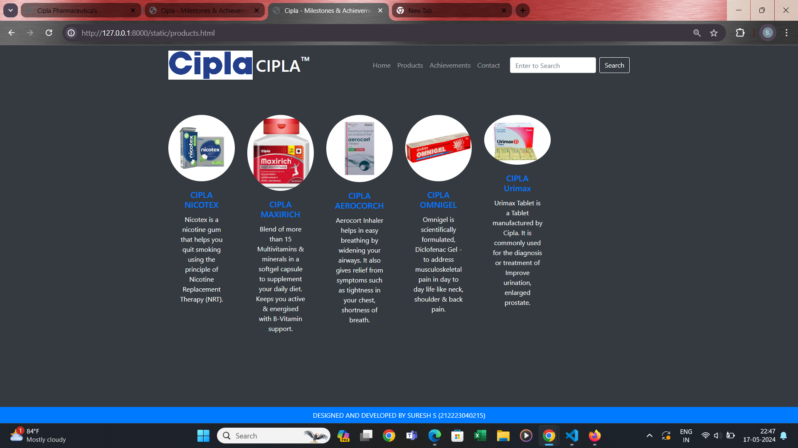

# Project Responsive Web Design using Bootstrap
## Date:14-05-2024 

## AIM:
To design a responsive website for a Pharmaceutical Company using Bootstrap.


## DESIGN STEPS:

### Step 1:
Clone the repository from GitHub.

### Step 2:
Create Django Admin project.

### Step 3:
Create a New App under the Django Admin project.

### Step 4:
Insert the necessary CSS and JavaScript files as external in order to use Bootstrap.

### Step 5:
Create a HTML file and include the needed Bootstrap components.

### Step 6:
Publish the website in the LocalHost.

## PROGRAM :
## home.html
```
<html>
    <head>
        <meta name="viewport" content="width=device-width, initial-scale=1.0">
        <title> Pharmaceutical Company </title>
        <style type="text/css">
            * {
                margin: 0;
                padding: 0;
                font-family: Arial, Helvetica, sans-serif;
            }
            .banner {
                width: 100%;
                height: 100vh;
                background-image: linear-gradient(rgba(0,0,0,0.75),rgba(0,0,0,0.75)),url(wallpaper\ for\ intel\ 1.jpg);
                background-size: cover;
                background-position: center;
            }
            .navbar {
                width: 90%;
                margin: auto;
                padding: 35px 0;
                display: flex;
                align-items: center;
                justify-content: space-between;
            }
            .logo {
                color: #6fa1f8;
                font-size: 35px;
                font-weight: 700;
                margin-left: -100px;
                letter-spacing: 3px;
            }
            img{
                height:70px;
                margin-top:-3px;
                margin-left:5px;
                margin-right:5px;
            }
            span {
                color: white;
            }
            
            form {
                width: 300px;
                height: 40px;
                display: flex;
                background: rgba(255, 255, 255, 0.2);
                padding: 1px 1px;
                font-size: 15px;
                border-radius: 10px;
                backdrop-filter: blur(4px) saturate(180%);
            }
            form input {
                background: transparent;
                flex: 1;
                border: 0;
                outline: none;
                padding: 12px 20px;
                font-size: 15px;
                color: white;
            } 
            ::placeholder {
                color: white;
            }
            form button {
                border: 0;
                outline: none;
                padding: 5px 20px;
                color: white;
                border-radius: 10px;
                background: #6fa1f8;
                cursor: pointer;
            }
            .navbar li {
                list-style: none;
                display: inline-block;
                margin: 0 20px;
                position: relative;
            }
            .navbar li a {
                text-decoration: none;
                color: white;
                text-transform: uppercase;
            }
            .navbar li:hover {
                border: 1px;
                padding: 10px;
                color: white;
                background-color: #6fa1f8;
                transition: 0.5s; 
                cursor: pointer;
                border-radius: 30px;
            }
            .content {
                position: absolute;
                top: 52%;
                left: 50%;
                transform: translate(-50%,-50%);
                text-align: center;
            }
            .text h2 {
                color:#6fa1f8;
                font-weight: 700;
                font-size: 50px;
                letter-spacing: 3px;
            }
            .text h3 {
                color:#6fa1f8;
                font-weight: 700;
                font-size: 45px;
                letter-spacing: 3px;
            }
            .text p {
                color:white;
                text-transform: capitalize;
                font-size: 24px;
                margin-bottom: 30px;
                word-spacing: 2px;
                letter-spacing: 1px;
            }
            .login {
                margin: 4px -20px;
                border: 2px solid #6fa1f8;
                padding: 13px 35px;
                letter-spacing: 1px;
                color: white;
                border-radius: 30px;
                background-color: #6fa1f8;
                text-decoration: none;
            }
            .login:hover {
                border: 2px solid #6fa1f8;
                color: #6fa1f8;
                background-color: white;
                transition: 0.5s;
                cursor: pointer;
            } 
            .signup {
                margin: 0px 50px;
                border: 2px solid #6fa1f8;
                padding: 13px 35px;
                letter-spacing: 1px;
                color: white;
                border-radius: 30px;
                background-color: #6fa1f8;
                text-decoration: none;
            }
            .signup:hover {
                border: 2px solid #6fa1f8;
                color: #6fa1f8;
                background-color:white;
                transition: 0.5s;
                cursor: pointer;
            }
            footer {
                background-color: #6fa1f8;
                margin-top: auto;
            }
        </style>
    </head>
<body>
    <div class="banner">
        <br>
        <div class="navbar">
            
            <h1 class="logo">CIPLA</span><sup>&trade;</sup></h1>
            <ul>
                <li><a href="http://127.0.0.1:8000/static/home.html"> Home </a></li>
                <li><a href="http://127.0.0.1:8000/static/products.html"> Products </a></li>
                <li><a href="http://127.0.0.1:8000/static/people.html">Acheivements</a></li>
                <li><a href="http://127.0.0.1:8000/static/contact.html"> Contact </a></li>
            </ul>
            <form action="" method="get">
                <input type="text" placeholder="Enter to Search">
                <button type="submit"> Search </button>
            </form>
        </div>
        
        </div>
        <div class="content">
            <div class="text">
                <h2 class="logo">CIPLA<h2>
                <h3 class="logo">PHARMACEUTICALS</h3>
                <br>
                <p>With our growing scientific understanding of rare diseases, we shall continue to introduce ground breaking therapies to give our patients their new beginnings!</p>
                <br>
                <div>
                    <a href="#" class="login">LOG IN</a>
                    <a href="#" class="signup">SIGN UP</a>
                </div>
                
                
            </div>
        </div>  
    </div>
    <footer>
        <center>DESIGNED   AND   DEVELOPED   BY   SURESH S (212223040215) </center>
    </footer>
</body>
</html>
```
## products.html
```
<html>
    <head>
        <meta name="viewport" content="width=device-width, initial-scale=1.0">
        <title> Pharmaceutical Company </title>
        <style type="text/css">
            * {
                margin: 0;
                padding: 0;
                font-family: Arial, Helvetica, sans-serif;
            }
            .banner {
                width: 100%;
                height: 100vh;
                background-image: linear-gradient(rgba(0,0,0,0.75),rgba(0,0,0,0.75)),url(wallpaper\ for\ intel\ 1\ copy.jpg);
                background-size: cover;
                background-position: center;
            }
            .navbar {
                width: 90%;
                margin: auto;
                padding: 35px 0;
                display: flex;
                align-items: center;
                justify-content: space-between;
            }
            .logo {
                color: #6fa1f8;
                font-size: 35px;
                font-weight: 700;
                margin-left: -100px;
                letter-spacing: 3px;
            }
            img{
                height:70px;
                margin-top:-3px;
                margin-left:5px;
                margin-right:5px;
            }
            span {
                color: white;
            }
            
            form {
                width: 300px;
                height: 40px;
                display: flex;
                background: rgba(255, 255, 255, 0.2);
                padding: 1px 1px;
                font-size: 15px;
                border-radius: 10px;
                backdrop-filter: blur(4px) saturate(180%);
            }
            form input {
                background: transparent;
                flex: 1;
                border: 0;
                outline: none;
                padding: 12px 20px;
                font-size: 15px;
                color: white;
            } 
            ::placeholder {
                color: white;
            }
            form button {
                border: 0;
                outline: none;
                padding: 5px 20px;
                color: white;
                border-radius: 10px;
                background: #6fa1f8;
                cursor: pointer;
            }
            .navbar li {
                list-style: none;
                display: inline-block;
                margin: 0 20px;
                position: relative;
            }
            .navbar li a {
                text-decoration: none;
                color: white;
                text-transform: uppercase;
            }
            .navbar li:hover {
                border: 1px;
                padding: 10px;
                color: white;
                background-color: #6fa1f8;
                transition: 0.5s; 
                cursor: pointer;
                border-radius: 30px;
            }
            .container {
                background: transparent;
                top: 100%;
                padding: 120px 5%;
                padding-bottom: 100px;
            }
            .container .box-container {
                display: grid;
                grid-template-columns: repeat(auto-fit, minmax(170px, 1fr));
                gap: 40px;
            }
            .container .box-container .box {
                color: white;
                box-shadow: 0 5px 10px rgba(0,0,0,.2);
                border-radius: 20px;
                background: transparent;
                border: 1px solid white;
                padding: 30px 20px;
            }
            .container .box-container .box img {
                height: 90px;
                border-radius: 20px;
            }
            .container .box-container .box h3 {
                color:#6fa1f8;
                font-size: larger;
                line-height: 4;
                padding: 10px 0;
            }
            .container .box-container .box p {
                color: white;
                font-size: large;
                line-height: 2;
            }
            footer {
                background-color: #6fa1f8;
                margin-top: auto;
            }
        </style>
    </head>
<body>
    <div class="banner">
        <br>
        <div class="navbar">
            
            <h1 class="logo">CIPLA</span><sup>&trade;</sup></h1>
            <ul>
                <li><a href="http://127.0.0.1:8000/static/home.html"> Home </a></li>
                <li><a href="http://127.0.0.1:8000/static/products.html"> Products </a></li>
                <li><a href="http://127.0.0.1:8000/static/people.html">Acheivements</a></li>
                <li><a href="http://127.0.0.1:8000/static/contact.html"> Contact </a></li>
            </ul>
            <form action="" method="get">
                <input type="text" placeholder="Enter to Search">
                <button type="submit"> Search </button>
            </form>
        </div>
        
        <div class="container">
            <div class="box-container">
                <div class="box">
                    
                    <h3>CIPLA NICOTEX</h3>
                    <p>Nicotex is a nicotine gum that helps you quit smoking using the principle of Nicotine Replacement Therapy (NRT).</p>
                </div>
                <div class="box">
                    
                    <h3>CIPLA MAXIRICH</h3>
                    <p>Blend of more than 15 Multivitamins & minerals in a softgel capsule to supplement your daily diet. Keeps you active & energised with B-Vitamin support. </p>
                </div>
                <div class="box">
                    
                    <h3>CIPLA AEROCORCH</h3>
                    <p>Aerocort Inhaler helps in easy breathing by widening your airways. It also gives relief from symptoms such as tightness in your chest, shortness of breath, wheezing and coughing..</p>
                </div>
                <div class="box">
                    
                    <h3>CIPLA OMNIGEL</h3>
                    <p>Omnigel is scientifically formulated, Diclofenac Gel - to address musculoskeletal pain in day to day life like neck, shoulder & back pain.</p>
                </div>
                <div class="box">
                    
                    <h3>CIPLA Urimax</h3>
                    <p>Urimax Tablet is a Tablet manufactured by Cipla. It is commonly used for the diagnosis or treatment of Improve urination, enlarged prostate.</p>
                </div>
            </div>
        </div>
    </div>
    <footer>
        <center>DESIGNED   AND   DEVELOPED   BY   SURESH S (212223040215) </center>
    </footer>
</body>
</html>
```


## people.html
```
<html>
    <head>
        <meta name="viewport" content="width=device-width, initial-scale=1.0">
        <title> Pharmaceutical Company </title>
        <style type="text/css">
            * {
                margin: 0;
                padding: 0;
                font-family: Arial, Helvetica, sans-serif;
            }
            
            
            .banner {
                width: 100%;
                height: 100vh;
                background-image: linear-gradient(rgba(0,0,0,0.75),rgba(0,0,0,0.75)),url(wallpaper\ for\ intel\ 1.jpg);
                background-size: cover;
                background-position: center;
            }
            .navbar {
                width: 90%;
                margin: auto;
                padding: 35px 0;
                display: flex;
                align-items: center;
                justify-content: space-between;
            }
            
            
            
            .logo {
                color: #6fa1f8;
                font-size: 35px;
                font-weight: 700;
                margin-left: -90px;
                letter-spacing: 3px;
            }
            img{
                height:50px;
                margin-top:-3px;
                margin-left:-5px;
                margin-right:5px;
            }
            span {
                color: white;
            }
            
            form {
                width: 300px;
                height: 40px;
                display: flex;
                background: rgba(255, 255, 255, 0.2);
                padding: 1px 1px;
                font-size: 15px;
                border-radius: 10px;
                backdrop-filter: blur(4px) saturate(195%);
            }
            form input {
                background: transparent;
                flex: 1;
                border: 0;
                outline: none;
                padding: 12px 20px;
                font-size: 15px;
                color: white;
            } 
            ::placeholder {
                color: white;
            }
            form button {
                border: 0;
                outline: none;
                padding: 5px 20px;
                color: white;
                border-radius: 10px;
                background: #6fa1f8;
                cursor: pointer;
            }
            .navbar li {
                list-style: none;
                display: inline-block;
                margin: 0 20px;
                position: relative;
            }
            .navbar li a {
                text-decoration: none;
                color: white;
                text-transform: uppercase;
            }
            .navbar li:hover {
                border: 1px;
                padding: 10px;
                color: white;
                background-color: #6fa1f8;
                transition: 0.5s; 
                cursor: pointer;
                border-radius: 30px;
            }
            .image {
                position: relative;
                border: 0;
                top: 100px;
                
                background: transparent;
            }
            .image table {
                border: 0;
                color: white;
                position: relative;
                left: 180px;
                
            }
            .image table img {
                height: 140px;
                width: 140px;
                border: 2px solid white;
                padding: 5px;
                border-radius: 50%;
            }
            .image table td {
                color: #eefe0a;
            }
            footer {
                background-color: #6fa1f8;
                margin-top: auto;
            }
        </style>
    </head>
<body>
    <div class="banner">
        <br>

        <div class="navbar">
            
            <h1 class="logo">CIPLA</span><sup>&trade;</sup></h1>
            <ul>
                <li><a href="http://127.0.0.1:8000/static/home.html"> Home </a></li>
                <li><a href="http://127.0.0.1:8000/static/products.html"> Products </a></li>
                <li><a href="http://127.0.0.1:8000/static/people.html" class="bg-people"> Acheivements</a></li>
                <li><a href="http://127.0.0.1:8000/static/contact.html"> Contact </a></li>
            </ul>
            <form action="" method="get">
                <input type="text" placeholder="Enter to Search">
                <button type="submit"> Search </button>
            </form>
        </div>
        <br>
        <br>
        <br>
        <br>
                <h2 class="logo" align="center"  >CIPLA<h2>
                <h3 class="logo" align="center">MILESTONES & ACHEIVEMENTS</h3>
        <div class="image">
            <table cellspacing="20"> 
                <tr align="center">
                    <td>  </td>
                    <td>  </td>
                    <td>  </td>
                    <td>  </td>
                    <td>  </td>
                    <td>  </td>
                    
                
                <tr align="center">
                    <td> HEALTH & WELLNESS AWARD</td>
                    <td> GOLDEN PEACOCK AWARD</td>
                    <td> LOGISTICS COMPANY AWARD</td>
                    <td> INDIA PHARMA AWARD 2022 </td>
                    <td> SILVER FEATHER AWARD</td>
                    <td>INDIAN PHARMA AWARDS 2023</td>
        
                </tr>
            </table>
        </div>
    </div>
    <footer>
        <center>DESIGNED   AND   DEVELOPED   BY   SURESH S (212223040215) </center>
    </footer>
</body>
</html>
```
## contact.html
```
<html>
    <head>
        <meta name="viewport" content="width=device-width, initial-scale=1.0">
        <title> Pharmaceutical Company </title>
        <style type="text/css">
            * {
                margin: 0;
                padding: 0;
                font-family: Arial, Helvetica, sans-serif;
            }
            .banner {
                width: 100%;
                height: 100vh;
                background-image: linear-gradient(rgba(0,0,0,0.75),rgba(0,0,0,0.75)),url(wallpaper\ for\ intel\ 1.jpg);
                background-size: cover;
                background-position: center;
            }
            .navbar {
                width: 90%;
                margin: auto;
                padding: 35px 0;
                display: flex;
                align-items: center;
                justify-content: space-between;
            }
            .logo {
                color: #6fa1f8;
                font-size: 35px;
                font-weight: 700;
                margin-left: -100px;
                letter-spacing: 3px;
            }
            img{
                height:70px;
                margin-top:-3px;
                margin-left:5px;
                margin-right:5px;
            }
            span {
                color: white;
            }
            
            form {
                width: 300px;
                height: 40px;
                display: flex;
                background: rgba(255, 255, 255, 0.2);
                padding: 1px 1px;
                font-size: 15px;
                border-radius: 10px;
                backdrop-filter: blur(4px) saturate(180%);
            }
            form input {
                background: transparent;
                flex: 1;
                border: 0;
                outline: none;
                padding: 12px 20px;
                font-size: 15px;
                color: white;
            } 
            ::placeholder {
                color: white;
            }
            form button {
                border: 0;
                outline: none;
                padding: 5px 20px;
                color: white;
                border-radius: 10px;
                background: #6fa1f8;
                cursor: pointer;
            }
            .navbar li {
                list-style: none;
                display: inline-block;
                margin: 0 20px;
                position: relative;
            }
            .navbar li a {
                text-decoration: none;
                color: white;
                text-transform: uppercase;
            }
            .navbar li:hover {
                border: 1px;
                padding: 10px;
                color: white;
                background-color: #6fa1f8;
                transition: 0.5s; 
                cursor: pointer;
                border-radius: 30px;
            }
            .box {
                display: flex;
                column-gap: 20px;
                background: transparent;
                position: relative;
                top: 80px;
            }
            .box-1 {
                height: 330px;
                width: 430px;
                border: 3px solid white;
                border-radius: 50px;
                background: transparent;
                position: relative;
                top: 50px;
                left: 400px;
            }
            .box-2 {
                height: 330px;
                top: 50px;
                width: 430px;
                border: 3px solid white;
                border-radius: 50px;
                background: transparent;
                position: relative;
                left: 480px;
            }
            .box-1 form {
                display: flex;
                color:white;
                background: transparent;
                padding: 10px;
                font-size: 15px;
                position: relative;
                top: 15px;
            }
            .box-1 form input {
                background: transparent;
                display: flex;
                border: 1px solid white;
                border-radius: 10px;
                padding: 15px 20px;
                font-size: 15px;
                color: white;
                position: relative;
                top: 20px;
            }
            .box-1 form textarea {
                background: transparent;
                display: flex;
                color: white;
                padding: 5px 10px;
                position: relative;
                top: 30px;
                left: 41px;
                border: 1px solid white;
                border-radius: 10px;
            }
            .box-1 form button {
                border: 0;
                outline: none;
                padding: 5px 30px;
                left: 30px;
                color: white;
                border-radius: 50px;
                background: #6fa1f8;
                cursor: pointer;
                position: relative;
                top: 30px;
            }
            box-2 h2 {
                color: white;
                position: relative;
                top: 25px;
                left: 100px;
                font-size: 30px;
            }
            .box-2 h2 {
                color: white;
                position: relative;
                top: 25px;
                left: 50px;
                font-size: 30px;
            }
            .box-2 p {
                color: white;
                position: relative;
                top: 50px;
                padding: 10px 80px;
            }
            .box-2 span {
                color: #6fa1f8;
                font-size: 20px;
            }
            footer {
                background-color: #6fa1f8;
                margin-top: auto;
            }
        </style>
    </head>
<body>
    <div class="banner">
        <br>
        <div class="navbar">
            
            <h1 class="logo">CIPLA</span><sup>&trade;</sup></h1>
            <ul>
                <li><a href="http://127.0.0.1:8000/static/home.html"> Home </a></li>
                <li><a href="http://127.0.0.1:8000/static/products.html"> Products </a></li>
                <li><a href="http://127.0.0.1:8000/static/people.html">Acheivements</a></li>
                <li><a href="http://127.0.0.1:8000/static/contact.html"> Contact </a></li>
            </ul>
            <form action="" method="get">
                <input type="text" placeholder="Enter to Search">
                <button type="submit"> Search </button>
            </form>
        </div>
        <div class="box">
            <div class="box-1">
                <form>
                    <center>
                        <h1> Contact Us </h1>
                        <input type="text" placeholder="Your Name">
                        <br>
                        <input type="email" placeholder="Your Email">
                        <br>
                        <textarea rows="2" cols="30" placeholder="Your Message"> </textarea>
                        <br>
                        <button type="submit"> Submit </button>
                    </center>
                </form>
            </div>
        <div class="box-2"> 
            <h2> Contact Information </h2>
            <p> <span>Address</span> : Tidel park No.4, Rajiv Gandhi Salai, Taramani, Chennai</p>
            <p> <span>Email</span> : sureshdhanush2427@gmail.com</p>
            <p> <span>Phone</span> : 9876543210</p>
            <p> <span>SubCategory</span> : Subsidiary of Foreign company</p>
        </div>
    </div>
</div>
<footer>
    <center>DESIGNED   AND   DEVELOPED   BY   SURESH S (212223040215) </center>
</footer>
</body>
```
## OUTPUT:

## home.html

## products.html

## people.html

## contact.html


 
 

## RESULT:
The Project for responsive web design using Bootstrap is completed successfully.
