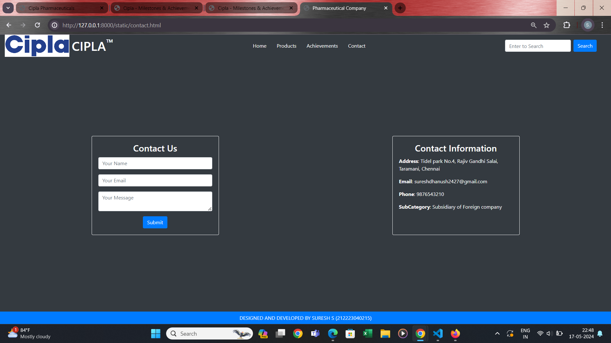

# Project Responsive Web Design using Bootstrap
## Date:14-05-2024 

## AIM:
To design a responsive website for a Pharmaceutical Company using Bootstrap.


## DESIGN STEPS:

### Step 1:
Clone the repository from GitHub.

### Step 2:
Create Django Admin project.

### Step 3:
Create a New App under the Django Admin project.

### Step 4:
Insert the necessary CSS and JavaScript files as external in order to use Bootstrap.

### Step 5:
Create a HTML file and include the needed Bootstrap components.

### Step 6:
Publish the website in the LocalHost.

## PROGRAM :
## home.html
```
<!DOCTYPE html>
<html lang="en">
<head>
    <meta charset="UTF-8">
    <meta name="viewport" content="width=device-width, initial-scale=1.0">
    <title>Cipla Pharmaceuticals</title>
    <!-- Bootstrap CSS -->
    <link href="https://stackpath.bootstrapcdn.com/bootstrap/4.5.2/css/bootstrap.min.css" rel="stylesheet">
</head>
<body class="d-flex flex-column min-vh-100 bg-dark text-light">

<!-- Navbar -->
<nav class="navbar navbar-expand-lg navbar-dark bg-dark">
    <div class="d-flex align-items-center">
        <br>

        
        <h1 class="mb-0 ml-2">CIPLA <sup>&trade;</sup></h1>
    </div>
    <button class="navbar-toggler" type="button" data-toggle="collapse" data-target="#navbarNav" aria-controls="navbarNav" aria-expanded="false" aria-label="Toggle navigation">
        <span class="navbar-toggler-icon"></span>
    </button>
    <div class="collapse navbar-collapse" id="navbarNav">
        <ul class="navbar-nav ml-auto">
            <li class="nav-item">
                <a class="nav-link" href="#">Home</a>
            </li>
            <li class="nav-item">
                <a class="nav-link" href="#">Products</a>
            </li>
            <li class="nav-item">
                <a class="nav-link" href="#">Achievements</a>
            </li>
            <li class="nav-item">
                <a class="nav-link" href="#">Contact</a>
            </li>
        </ul>
        <form class="form-inline my-2 my-lg-0">
            <input class="form-control mr-sm-2" type="search" placeholder="Enter to Search" aria-label="Search">
            <button class="btn btn-outline-info my-2 my-sm-0" type="submit">Search</button>
        </form>
    </div>
</nav>

<!-- Main Content -->
<div class="container d-flex flex-column justify-content-center text-center flex-grow-1">
    <h1 class="display-4">CIPLA PHARMACEUTICALS</h1>
    <p class="lead">With Our Growing Scientific Understanding Of Rare Diseases, We Shall Continue To Introduce Ground Breaking Therapies To Give Our Patients Their New Beginnings!</p>
    <div class="mt-4">
        <a href="#" class="btn btn-primary btn-lg mx-2">Log In</a>
        <a href="#" class="btn btn-primary btn-lg mx-2">Sign Up</a>
    </div>
</div>

<!-- Footer -->
<footer class="footer mt-auto py-2 bg-primary text-center text-light">
    <div class="container">
        <span>DESIGNED AND DEVELOPED BY SURESH S (212223040215)</span>
    </div>
</footer>

<!-- Bootstrap JS and dependencies -->
<script src="https://code.jquery.com/jquery-3.5.1.slim.min.js"></script>
<script src="https://cdn.jsdelivr.net/npm/@popperjs/core@2.5.4/dist/umd/popper.min.js"></script>
<script src="https://stackpath.bootstrapcdn.com/bootstrap/4.5.2/js/bootstrap.min.js"></script>
</body>
</html>

```
## products.html
```
<!DOCTYPE html>
<html lang="en">
<head>
    <meta charset="UTF-8">
    <meta name="viewport" content="width=device-width, initial-scale=1.0">
    <title>Cipla - Milestones & Achievements</title>
    <!-- Bootstrap CSS -->
    <link href="https://stackpath.bootstrapcdn.com/bootstrap/4.5.2/css/bootstrap.min.css" rel="stylesheet">
</head>
<body class="d-flex flex-column min-vh-100 bg-dark text-white">

    <!-- Navbar -->
    <nav class="navbar navbar-expand-lg navbar-dark bg-dark">
        <div class="container">
            <a class="navbar-brand d-flex align-items-center" href="#">
                
                <h1 class="mb-0">CIPLA<sup>&trade;</sup></h1>
            </a>
            <button class="navbar-toggler" type="button" data-toggle="collapse" data-target="#navbarNav" aria-controls="navbarNav" aria-expanded="false" aria-label="Toggle navigation">
                <span class="navbar-toggler-icon"></span>
            </button>
            <div class="collapse navbar-collapse" id="navbarNav">
                <ul class="navbar-nav ml-auto">
                    <li class="nav-item">
                        <a class="nav-link" href="#">Home</a>
                    </li>
                    <li class="nav-item">
                        <a class="nav-link" href="#">Products</a>
                    </li>
                    <li class="nav-item">
                        <a class="nav-link" href="#">Achievements</a>
                    </li>
                    <li class="nav-item">
                        <a class="nav-link" href="#">Contact</a>
                    </li>
                </ul>
                <form class="form-inline ml-lg-3">
                    <input class="form-control mr-sm-2" type="search" placeholder="Enter to Search" aria-label="Search">
                    <button class="btn btn-outline-light my-2 my-sm-0" type="submit">Search</button>
                </form>
            </div>
        </div>
    </nav>

    <!-- Page Content -->
    <div class="container flex-fill my-5">
        <div class="row text-center mt-4">
            <div class="col-md-2 col-6">
                <div class="card bg-dark border-0">
                    
                    <div class="card-body">
                        <h5 class="card-title text-primary">CIPLA NICOTEX</h5>
                        <p class="card-text text-light">Nicotex is a nicotine gum that helps you quit smoking using the principle of Nicotine Replacement Therapy (NRT).</p>
                    </div>
                </div>
            </div>
            <div class="col-md-2 col-6">
                <div class="card bg-dark border-0">
                    
                    <div class="card-body">
                        <h5 class="card-title text-primary">CIPLA MAXIRICH</h5>
                        <p class="card-text text-light">Blend of more than 15 Multivitamins & minerals in a softgel capsule to supplement your daily diet. Keeps you active & energised with B-Vitamin support.</p>
                    </div>
                </div>
            </div>
            <div class="col-md-2 col-6">
                <div class="card bg-dark border-0">
                    
                    <div class="card-body">
                        <h5 class="card-title text-primary">CIPLA AEROCORCH</h5>
                        <p class="card-text text-light">Aerocort Inhaler helps in easy breathing by widening your airways. It also gives relief from symptoms such as tightness in your chest, shortness of breath.</p>
                    </div>
                </div>
            </div>
            <div class="col-md-2 col-6">
                <div class="card bg-dark border-0">
                    
                    <div class="card-body">
                        <h5 class="card-title text-primary">CIPLA OMNIGEL</h5>
                        <p class="card-text text-light">Omnigel is scientifically formulated, Diclofenac Gel - to address musculoskeletal pain in day to day life like neck, shoulder & back pain.</p>
                    </div>
                </div>
            </div>
            <div class="col-md-2 col-6">
                <div class="card bg-dark border-0">
                    
                    <div class="card-body">
                        <h5 class="card-title text-primary">CIPLA Urimax</h5>
                        <p class="card-text text-light">Urimax Tablet is a Tablet manufactured by Cipla. It is commonly used for the diagnosis or treatment of Improve urination, enlarged prostate.</p>
                    </div>
                </div>
            </div>
        </div>
    </div>

    <!-- Footer -->
    <footer class="bg-primary text-white text-center py-2 mt-auto">
        <p class="mb-0">DESIGNED AND DEVELOPED BY SURESH S (212223040215)</p>
    </footer>

    <!-- Bootstrap JS -->
    <script src="https://code.jquery.com/jquery-3.5.1.slim.min.js"></script>
    <script src="https://cdn.jsdelivr.net/npm/popper.js@1.16.1/dist/umd/popper.min.js"></script>
    <script src="https://stackpath.bootstrapcdn.com/bootstrap/4.5.2/js/bootstrap.min.js"></script>
</body>
</html>
```


## people.html
```
<!DOCTYPE html>
<html lang="en">
<head>
    <meta charset="UTF-8">
    <meta name="viewport" content="width=device-width, initial-scale=1.0">
    <title>Cipla - Milestones & Achievements</title>
    <!-- Bootstrap CSS -->
    <link href="https://stackpath.bootstrapcdn.com/bootstrap/4.5.2/css/bootstrap.min.css" rel="stylesheet">
</head>
<body class="d-flex flex-column min-vh-100 bg-dark text-white">

    <!-- Navbar -->
    <nav class="navbar navbar-expand-lg navbar-dark bg-dark">
        <div class="container">
            <a class="navbar-brand d-flex align-items-center" href="#">
                
                <h1 class="mb-0">CIPLA<sup>&trade;</sup></h1>
            </a>
            <button class="navbar-toggler" type="button" data-toggle="collapse" data-target="#navbarNav" aria-controls="navbarNav" aria-expanded="false" aria-label="Toggle navigation">
                <span class="navbar-toggler-icon"></span>
            </button>
            <div class="collapse navbar-collapse" id="navbarNav">
                <ul class="navbar-nav ml-auto">
                    <li class="nav-item">
                        <a class="nav-link" href="#">Home</a>
                    </li>
                    <li class="nav-item">
                        <a class="nav-link" href="#">Products</a>
                    </li>
                    <li class="nav-item">
                        <a class="nav-link" href="#">Achievements</a>
                    </li>
                    <li class="nav-item">
                        <a class="nav-link" href="#">Contact</a>
                    </li>
                </ul>
                <form class="form-inline ml-lg-3">
                    <input class="form-control mr-sm-2" type="search" placeholder="Enter to Search" aria-label="Search">
                    <button class="btn btn-outline-light my-2 my-sm-0" type="submit">Search</button>
                </form>
            </div>
        </div>
    </nav>

    <!-- Page Content -->
    <div class="container flex-fill my-5">
        <div class="row text-center">
            <div class="col-12">
                <br>
                <h2>CIPLA MILESTONES & ACHIEVEMENTS</h2>
            </div>
        </div>
        <br>
        <br><br>
        <br><br>
        <div class="row text-center mt-4">
            <div class="col-md-2 col-6">
                
                <p class="text-warning">HEALTH & WELLNESS AWARD</p>
            </div>
            <div class="col-md-2 col-6">
                
                <p class="text-warning">GOLDEN PEACOCK AWARD</p>
            </div>
            <div class="col-md-2 col-6">
                
                <p class="text-warning">LOGISTICS COMPANY AWARD</p>
            </div>
            <div class="col-md-2 col-6">
                
                <p class="text-warning">INDIA PHARMA AWARD 2022</p>
            </div>
            <div class="col-md-2 col-6">
                
                <p class="text-warning">SILVER FEATHER AWARD</p>
            </div>
        </div>
    </div>

    <!-- Footer -->
    <footer class="bg-primary text-white text-center py-2 mt-auto">
        <p class="mb-0">DESIGNED AND DEVELOPED BY SURESH S (212223040215)</p>
    </footer>

    <!-- Bootstrap JS -->
    <script src="https://code.jquery.com/jquery-3.5.1.slim.min.js"></script>
    <script src="https://cdn.jsdelivr.net/npm/popper.js@1.16.1/dist/umd/popper.min.js"></script>
    <script src="https://stackpath.bootstrapcdn.com/bootstrap/4.5.2/js/bootstrap.min.js"></script>
</body>
</html>

```
## contact.html
```
<!DOCTYPE html>
<html lang="en">
<head>
    <meta charset="UTF-8">
    <meta name="viewport" content="width=device-width, initial-scale=1.0">
    <title>Pharmaceutical Company</title>
    <!-- Bootstrap CSS -->
    <link href="https://stackpath.bootstrapcdn.com/bootstrap/4.5.2/css/bootstrap.min.css" rel="stylesheet">
</head>
<body class="bg-dark text-white d-flex flex-column min-vh-100">

    <div class="container-fluid flex-grow-1 d-flex flex-column">
        <div class="row w-100 mb-4">
            <div class="col-12 d-flex justify-content-between align-items-center">
                <div class="d-flex align-items-center">
                    
                    <h1 class="mb-0 ml-2">CIPLA<sup>&trade;</sup></h1>
                </div>
                <ul class="nav">
                    <li class="nav-item">
                        <a class="nav-link text-white" href="http://127.0.0.1:8000/static/home.html">Home</a>
                    </li>
                    <li class="nav-item">
                        <a class="nav-link text-white" href="http://127.0.0.1:8000/static/products.html">Products</a>
                    </li>
                    <li class="nav-item">
                        <a class="nav-link text-white" href="http://127.0.0.1:8000/static/people.html">Achievements</a>
                    </li>
                    <li class="nav-item">
                        <a class="nav-link text-white" href="http://127.0.0.1:8000/static/contact.html">Contact</a>
                    </li>
                </ul>
                <form class="form-inline">
                    <input class="form-control mr-2" type="search" placeholder="Enter to Search">
                    <button class="btn btn-primary" type="submit">Search</button>
                </form>
            </div>
        </div>
        <div class="d-flex flex-grow-1 justify-content-center align-items-center">
            <div class="row w-100 justify-content-center">
                <div class="col-md-6 d-flex justify-content-center mb-3">
                    <div class="card bg-dark text-white border-light" style="width: 100%; max-width: 400px;">
                        <div class="card-body">
                            <h3 class="card-title text-center">Contact Us</h3>
                            <form>
                                <div class="form-group">
                                    <input type="text" class="form-control" placeholder="Your Name">
                                </div>
                                <div class="form-group">
                                    <input type="email" class="form-control" placeholder="Your Email">
                                </div>
                                <div class="form-group">
                                    <textarea class="form-control" rows="2" placeholder="Your Message"></textarea>
                                </div>
                                <div class="text-center">
                                    <button type="submit" class="btn btn-primary">Submit</button>
                                </div>
                            </form>
                        </div>
                    </div>
                </div>
                <div class="col-md-6 d-flex justify-content-center mb-3">
                    <div class="card bg-dark text-white border-light" style="width: 100%; max-width: 400px;">
                        <div class="card-body">
                            <h3 class="card-title text-center">Contact Information</h3>
                            <p><strong>Address</strong>: Tidel park No.4, Rajiv Gandhi Salai, Taramani, Chennai</p>
                            <p><strong>Email</strong>: sureshdhanush2427@gmail.com</p>
                            <p><strong>Phone</strong>: 9876543210</p>
                            <p><strong>SubCategory</strong>: Subsidiary of Foreign company</p>
                        </div>
                    </div>
                </div>
            </div>
        </div>
    </div>
    <footer class="bg-primary text-white text-center py-2 mt-auto">
        DESIGNED AND DEVELOPED BY SURESH S (212223040215)
    </footer>

    <!-- Bootstrap JS and dependencies -->
    <script src="https://code.jquery.com/jquery-3.5.1.slim.min.js"></script>
    <script src="https://cdn.jsdelivr.net/npm/@popperjs/core@2.5.4/dist/umd/popper.min.js"></script>
    <script src="https://stackpath.bootstrapcdn.com/bootstrap/4.5.2/js/bootstrap.min.js"></script>
</body>
</html>

```
## OUTPUT:

## home.html

## products.html

## people.html

## contact.html


 
 

## RESULT:
The Project for responsive web design using Bootstrap is completed successfully.
